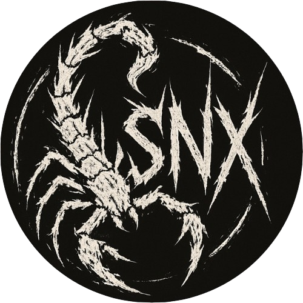

  
  <h1>¡Hola! Soy Saenex 👋</h1>
  <h3>Tecnólogo en Desarrollo de Sistemas, focalizado en IA y Calidad de Código.</h3>

---

## 👨‍💻 Sobre Mí

Soy Técnico en Sistemas con experiencia en soporte y mantenimiento de hardware y software. Actualmente, me estoy formando como Tecnólogo en Desarrollo de Sistemas y he orientado mis habilidades de forma rigurosa hacia el desarrollo de software.

Me distingo por mi organización, mi enfoque detallista y mi alta capacidad de **adaptación y aprendizaje continuo**

## 🛠️ Stack y Habilidades Técnicas

| Área | Herramientas y Conceptos Clave |
| :--- | :--- |
| **Desarrollo (Core)** | Python (Computer Vision, Lógica AI), JavaScript, C# (Manejo de proyectos), SQL. |
| **Fundamentos de IA** | OpenCV, MediaPipe, NumPy, Jupyter/Colab, **Lógica Probabilística**. |
| **Calidad de Código** | Git y GitHub (Workflow Profesional), Unit Testing, GitHub Actions (CI/CD). |
| **Sistemas & IT** | Mantenimiento Preventivo y Correctivo, Windows Server, Cableado. |

## ⭐ Proyecto Destacado

El proyecto **[PPT-JUEGO-IA](https://github.com/saenex/PPT-JUEGO-IA)** (Piedra/Papel/Tijeras con Visión Artificial) fue desarrollado en el marco de mi **Certificado: Inteligencia Artificial Básico**. Demuestra la aplicación de:
1.  **Visión Artificial:** Detección de gestos de mano en tiempo real.
2.  **Lógica de IA:** Modelo predictivo.
3.  **Ingeniería de Software:** Pruebas unitarias, CI/CD y documentación bilingüe.

## 🎓 Formación Académica

* **Tecnología en Desarrollo de Sistemas de Información y Software**
    **Universidad Santiago de Cali (USC)** | *Actualmente en curso*

* **Técnico en Sistemas** **SENA - Regional Valle** |*2022*]

* **Certificado: Inteligencia Artificial Básico**
    **MinTIC / Bootcamps Libret (2025)**

---

  Si deseas contactarme o hacer preguntas sobre mis proyectos, por favor utiliza la función de "Issues" o "Discussions" de GitHub.

